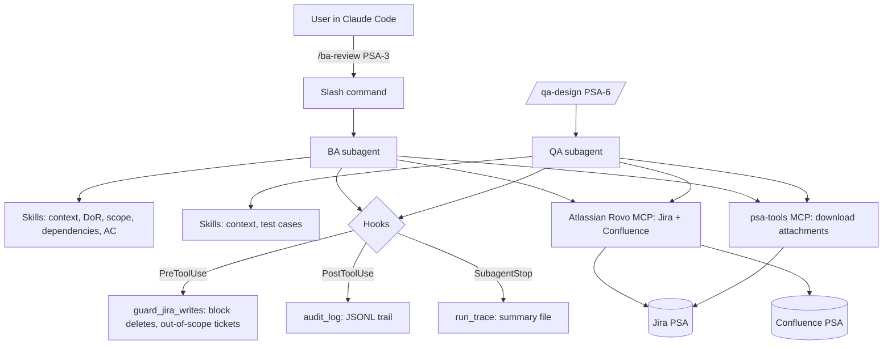

# SDLC Agent System: Design

## 1. Goal
Build agents that take on SDLC roles for the Photo Sorting App (PSA) project. Each agent accepts a Jira ticket key, gathers context (description, comments, attachments, linked tickets, Confluence knowledge base), performs its role's activities, and writes the results back to Jira with human approval.

## 2. Scope
| In this build | Designed, not built |
|---|---|
| BA agent (refine stories, check Definition of Ready) | PM agent (sprint summary, risk report) |
| QA agent (test design from acceptance criteria) | Triggering from Jira webhooks or CI |
| Developer team: senior (Opus), database and UI (Sonnet), junior (Haiku) | Live OpenTelemetry dashboards |
| Hooks, skills, custom attachment tool, evaluations, metrics and model benchmark | |

## 3. Platform and standards
| Concern | Choice | Standard |
|---|---|---|
| Agent runtime | Claude Code (Pro plan) | Subagents, skills, hooks, slash commands |
| Jira and Confluence access | Atlassian Rovo MCP server (official, remote) | Model Context Protocol |
| Attachments | Custom `psa-tools` MCP server (Python) | Model Context Protocol |
| Role knowledge | Skills in `.claude/skills/*/SKILL.md` | Agent Skills format |
| Project knowledge | Confluence space PSA + `CLAUDE.md` | arc42, C4, MADR, Gherkin |
| Guardrails and audit | Claude Code hooks + permission rules | Least privilege, human in the loop |

## 4. Architecture

## 5. Agent workflow (BA example)
1. **Trigger**: `/ba-review PSA-3`.
2. **Gather context** (skill `gather-ticket-context`): ticket fields, comments, linked tickets and their open comments, attachments downloaded and read (images viewed directly), relevant Confluence pages (roadmap, requirements, BA standards, personas).
3. **Analyze** using skills:
   - `definition-of-ready-check`: list which DoR items pass or fail.
   - `detect-scope-conflicts`: compare the ticket against the roadmap, related stories and attachments.
   - `analyze-dependencies`: blockers not Done, open questions in blockers.
4. **Produce** (skill `write-acceptance-criteria`): user story rewrite, Given/When/Then criteria, clarifying questions, risks.
5. **Propose** the Jira changes in the terminal.
6. **Approve**: Claude Code asks permission before any Jira write tool runs.
7. **Write back**: comment with findings and questions, updated description, label `needs-clarification` or `ready-for-dev`.
8. **Trace**: hooks record every tool call and save a run summary under `runs/`.

## 6. Agents
| Agent | Inputs | Activities | Outputs | Allowed tools |
|---|---|---|---|---|
| BA | Ticket key | DoR check, scope and dependency analysis, AC writing, clarifying questions | Comment, refined description, label | Jira read and write (comment, edit, labels), Confluence read, psa-tools |
| QA | Ticket key (ready-for-dev) | Map each AC to tests, add edge cases from attachments and test strategy, flag untestable AC | Gherkin test cases as a comment, coverage table, gaps | Jira read, comment; Confluence read; psa-tools |
| Developer team | Ready ticket | Plan, build, review, ship (section 11) | Code, PR, Jira sub-tasks, metrics comment | See section 11 |

## 7. Skills
| Skill | Purpose | Used by |
|---|---|---|
| gather-ticket-context | Repeatable checklist for collecting all context, including linked tickets and attachments | BA, QA |
| definition-of-ready-check | Evaluate the ticket against the BA Standards page | BA |
| detect-scope-conflicts | Compare ticket vs roadmap phases, related stories, attachments | BA |
| analyze-dependencies | Find blockers that are not Done and their open questions | BA |
| write-acceptance-criteria | Given/When/Then rules and output template | BA |
| generate-test-cases | Gherkin format, coverage table, edge-case catalogue | QA |

## 8. Hooks
| Event | Hook | Behaviour |
|---|---|---|
| UserPromptSubmit | set_active_ticket.py | Records the ticket and role from `/ba-review` or `/qa-design` so writes can be restricted to that ticket |
| PreToolUse (Atlassian write tools) | guard_jira_writes.py | Blocks destructive, generic and out-of-role tools; blocks writes to tickets other than the one under review or outside project PSA; blocks editing existing comments; limits editJiraIssue to description and labels (labels only for QA) |
| PostToolUse (all MCP tools) | audit_log.py | Appends tool name, inputs (secrets removed), timestamp and outcome to `runs/audit.jsonl` |
| SubagentStop | run_trace.py | Writes `runs/traces/<timestamp>-<agent>-<KEY>.md` with tools used, writes allowed and blocked actions |
| SubagentStop | collect_metrics.py | Appends tokens, cost, duration, turns, tool calls and errors for the run to `runs/metrics/agent_runs.jsonl` |
| PreToolUse (Write, Edit, Bash) | guard_code_writes.py | Folder ownership per developer agent; blocks dangerous git and delete commands |

Permission rules in `.claude/settings.json` set Jira write tools to "ask", so a person approves every write.

## 9. Knowledge base
- **Confluence space PSA**: 11 design pages for the whole product (roadmap, requirements, architecture, data model, ADRs, feature specs, security, test strategy, engineering standards, BA standards, personas).
- **CLAUDE.md**: project memory with conventions, ticket key format, phase rules, where to find things.
- **Skills**: role expertise kept separate from project facts.

## 10. Demo scenarios and evaluation
| Scenario | Ticket | Expected findings (evaluation checklist) |
|---|---|---|
| 1. BA scope conflict | Import wizard story | Duplicate removal is Phase 2 (points to the duplicate review story); screenshot and size filters in the wireframe are missing from the description; no acceptance criteria; persona missing; blocked by schema story; label needs-clarification |
| 2. BA dependency awareness | Face labeling story | Blocked by face clustering story (not Done); open question 5 vs 10 faces, mockup shows 6; 15-person limit and Unknown handling missing; kids persona; label needs-clarification |
| 3. QA test design | EXIF story | One or more tests per AC; edge cases from attachment (no GPS, scanner date 1980, HEIC); gap: WhatsApp images with date only in file name are not covered by any AC |

Evaluation: `evals/expected_findings.json` lists the checks; `evals/check_run.py` scores the agent's report (`runs/reports/<KEY>-<role>.md`) against them.

## 11. Developer team
| Agent | Model | Owns (write access) | Role |
|---|---|---|---|
| senior-developer | Opus (fallback Sonnet, effort high) | app/core/metadata, runs/plans, runs/reviews | Plans, creates Jira sub-tasks, writes complex logic, reviews all code |
| database-developer | Sonnet | app/core/db, app/tests/test_db_* | Migrations, queries, DB tests |
| ui-developer | Sonnet | app/ui/src | React + TypeScript components, Vitest tests |
| junior-developer | Haiku | app/core/utils, app/tests | Small specified helpers and unit tests |

`/dev-implement <KEY>` (main session = orchestrator): precondition check, PLAN, BUILD (parallel when independent),
REVIEW, rework (max 2 rounds), verify (pytest, Vitest, ruff), ship (commit, push, PR with approval), metrics comment.
Skills: plan-implementation, review-code, write-db-migration, build-ui-component, write-unit-tests.
Guardrails: `guard_code_writes.py` enforces folder ownership by `agent_type`, blocks force push, push to main, hard reset,
deletes and merges, and blocks git writes, package installs and shell redirection inside subagents.
`guard_jira_writes.py` allows sub-task creation only under the active story and status changes only for planned sub-tasks.

## 12. Metrics
| Category | Metrics | Source |
|---|---|---|
| Consumption | Input, output, cache read and cache write tokens per agent and model; API-equivalent cost; cache hit ratio; share of tokens and cost per agent | `collect_metrics` hook: on SubagentStop for each subagent, on Stop for the main session ("orchestrator", measured incrementally per turn) |
| Speed | Duration, turns, tool calls per run | Transcript |
| Quality | Eval score (BA, QA); first-pass approval rate and rework rounds (developers); tests passed | evals, plan JSON, review file |
| Oversight and safety | Jira writes requested, executed and declined; guardrail blocks; tool error rate | Audit log |
| Efficiency | Tokens and cost per approved task | Report |
| Right-sizing | Same task on Haiku, Sonnet, Opus: hidden-test score vs cost and time | `metrics/benchmark.py` (headless Claude Code) |

Outputs: `runs/metrics/agent_runs.jsonl`, `benchmark.jsonl`, `dashboard.html`, and a Markdown summary posted to the story.

## 13. Usage attribution per agent
Goal: know which agent consumes the most tokens and cost.

Within one Claude Code session all subagents share the session's login (here, one Pro subscription),
so an agent cannot use its own account. Attribution is therefore done by identity, not by account.

| Level | Agent identity | Where usage is attributed | Cost | Status |
|---|---|---|---|---|
| 1. Attribution metadata | Agent name recorded by the metrics hook for every run, including the orchestrator | `runs/metrics/agent_runs.jsonl`; dashboard "Share of usage by agent" and "Top consumer" | Free | **Implemented** |
| 2. API key per agent | Each agent runs as its own headless Claude Code process with its own Anthropic API key; keys grouped into workspaces (for example BA/QA vs developer team) | Claude Console usage pages per key; Usage and Cost Admin API with `group_by[]=api_key_id` or `workspace_id` (requires an organization account) | Pay-as-you-go API | Production design |
| 3. LLM gateway | Virtual key per agent on a gateway (for example LiteLLM) that forwards to the Anthropic API | Gateway dashboard, with per-agent budgets and rate limits | Gateway hosting + API | Production design |

Level 1 attributes from the agents' own transcripts. Levels 2 and 3 attribute on the provider or gateway side,
which is independent of the agents and supports budgets, at the cost of replacing in-session subagents with
one process per agent and an orchestrator script. Level 1 records can be reconciled with Level 2 reports by model and day.

## 14. Risks and mitigations
| Risk | Mitigation |
|---|---|
| Official MCP server cannot fetch attachments | Custom psa-tools MCP server downloads them |
| Pro plan usage limits | Sonnet for agents, concise KB pages, deterministic context script, limited rehearsals |
| Agent writes something wrong to Jira | Permission prompt, guard hook, reset script restores tickets |
| Non-deterministic output | Evaluation checklist, structured output templates in skills |
| Subagent silently runs a different model | Model recorded per run from the transcript; do not set CLAUDE_CODE_SUBAGENT_MODEL |
| Opus not available on Pro | Senior developer falls back to Sonnet with effort high; benchmark records "unavailable" |
| A hook crashes and fails open | Audit logging never raises, so blocks always exit with code 2 |

## 15. Future work
PM agent; trigger from a Jira label via webhook or GitHub Actions running Claude Code headless; agent hand-off (BA marks ready, QA runs automatically).
